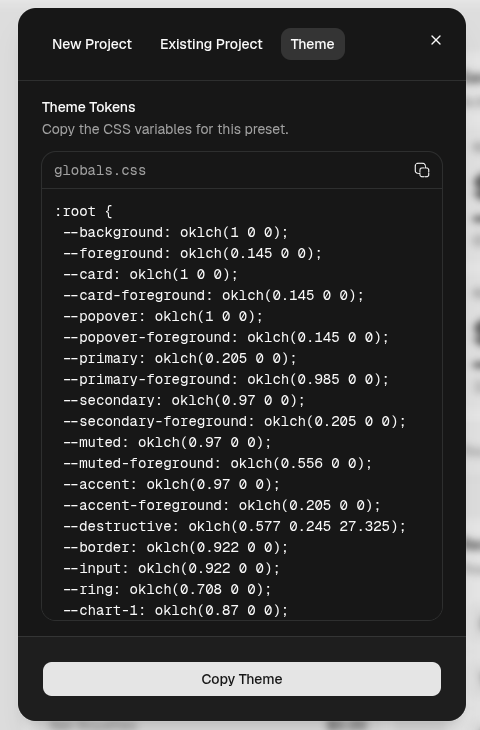

## shadcnのテーマを適応する方法の備考録

shadcnのテーマは、[公式ページ](https://ui.shadcn.com/create)でカスタマイズしたものを適用すればいいというのは分かったのですが、

shadcn/ui のテーマカスタマイズ画面で生成したCSS変数を globals.css に貼り付けても、テーマが反映されませんでした。

**出力されたコード**


### 前提

shadcn v4.7.0

### 適用方法

エントリーポイントに適用しているグローバルCSSファイルに、出力されたコードを貼り付ける。

私が出力したのはこんな感じのコードでした。

```css
:root {
    --accent: oklch(.97 0 0);
    --accent-foreground: oklch(.205 0 0);
    --background: oklch(91.121% .0187 17.198);
    --border: oklch(.922 0 0);
    --card: oklch(1 0 0);
    --card-foreground: oklch(.145 0 0);
    --chart-1: oklch(.809 .105 251.813);
    --chart-2: oklch(.623 .214 259.815);
    --chart-3: oklch(.546 .245 262.881);
    --chart-4: oklch(.488 .243 264.376);
    --chart-5: oklch(.424 .199 265.638);
    --destructive: oklch(.577 .245 27.325);
    --foreground: oklch(.145 0 0);
    --input: oklch(.922 0 0);
    --muted: oklch(.97 0 0);
    --muted-foreground: oklch(.556 0 0);
    --popover: oklch(1 0 0);
    --popover-foreground: oklch(.145 0 0);
    --primary: oklch(.491 .27 292.581);
    --primary-foreground: oklch(.969 .016 293.756);
    --radius: .45rem;
    --ring: oklch(.708 0 0);
    --secondary: oklch(.967 .001 286.375);
    --secondary-foreground: oklch(.21 .006 285.885);
    --sidebar: oklch(.985 0 0);
    --sidebar-accent: oklch(.97 0 0);
    --sidebar-accent-foreground: oklch(.205 0 0);
    --sidebar-border: oklch(.922 0 0);
    --sidebar-foreground: oklch(.145 0 0);
    --sidebar-primary: oklch(.541 .281 293.009);
    --sidebar-primary-foreground: oklch(.969 .016 293.756);
    --sidebar-ring: oklch(.708 0 0);
}

.dark {
    --accent: oklch(.269 0 0);
    --accent-foreground: oklch(.985 0 0);
    --background: oklch(.145 0 0);
    --border: oklch(1 0 0 / 10%);
    --card: oklch(.205 0 0);
    --card-foreground: oklch(.985 0 0);
    --chart-1: oklch(.809 .105 251.813);
    --chart-2: oklch(.623 .214 259.815);
    --chart-3: oklch(.546 .245 262.881);
    --chart-4: oklch(.488 .243 264.376);
    --chart-5: oklch(.424 .199 265.638);
    --destructive: oklch(.704 .191 22.216);
    --foreground: oklch(.985 0 0);
    --input: oklch(1 0 0 / 15%);
    --muted: oklch(.269 0 0);
    --muted-foreground: oklch(.708 0 0);
    --popover: oklch(.205 0 0);
    --popover-foreground: oklch(.985 0 0);
    --primary: oklch(.432 .232 292.759);
    --primary-foreground: oklch(.969 .016 293.756);
    --ring: oklch(.556 0 0);
    --secondary: oklch(.274 .006 286.033);
    --secondary-foreground: oklch(.985 0 0);
    --sidebar: oklch(.205 0 0);
    --sidebar-accent: oklch(.269 0 0);
    --sidebar-accent-foreground: oklch(.985 0 0);
    --sidebar-border: oklch(1 0 0 / 10%);
    --sidebar-foreground: oklch(.985 0 0);
    --sidebar-primary: oklch(.606 .25 292.717);
    --sidebar-primary-foreground: oklch(.969 .016 293.756);
    --sidebar-ring: oklch(.556 0 0);
}
```

しかし、これだけでは色は変更されず・・・

[公式ドキュメント](https://ui.shadcn.com/docs/theming#default-theme-css)を見ていると

```css
@theme inline {
    /* 省略 */
}
```

とinlineで適用する方法が書いてあったので、これをグローバルCSSファイルに追加してみると、テーマが適用されました。

tailwind v4 からCSSでテーマの変数を定義する方法が変わったようでした。

>@theme inline

という記法は[公式ドキュメント](https://tailwindcss.com/docs/theme#referencing-other-variables)に記載されています。

ざっくりいうと、tailwind cssで他のcss変数(var(--red))をユーティリティ クラスとして参照するための記法のようです。
