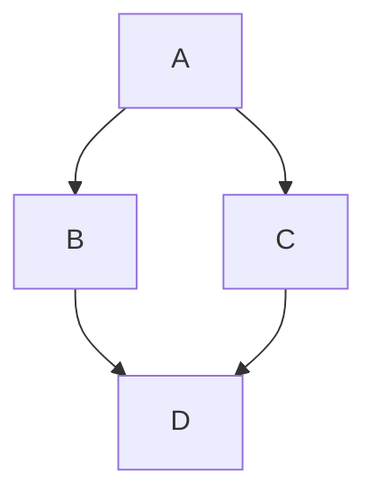

## 自分用 MarkDown チートシートまとめ

### 見出し

# 見出し 1

## 見出し 2

### 見出し 3

```md
# 見出し 1

## 見出し 2

### 見出し 3
```

### 装飾

**太字**
_イタリック_
**_太イタリック_**

```md
**太字**
_イタリック_
**_太イタリック_**
```

==マーカー==

```md
==マーカー==
```

++下線++

```md
++下線++
```

あああ^^上付き^^

```md
あああ^上付き^
```

### リンク

[github](https://github.com/)
<https://github.com/>

```md
[github](https://github.com/)
<https://github.com/>
```

### 引用

> 引用

> > 二重引用

```md
> 引用

> > 二重引用
```

### 箇条書き

- 箇条書き
- 箇条書き

```md
- 箇条書き
- 箇条書き

<ul>
 <li></li>
 <li></li>
</ul>
```

1. 箇条書き
2. 箇条書き

<ol>
 <li></li>
 <li></li>
</ol>
```
1. 箇条書き
2. 箇条書き
```

### 水平線

---

```md
---
```

### コード

`console.log("hello world!");`

```md
`console.log("hello world!");`
```

```javascript
const hello = (name) => {
  console.log(`こんにちは${name}さん`);
};

hello("yamada");

// output
// こんにちはyamadaさん
```

````md
/ ```javascript
const hello = (name) => {
 console.log(`こんにちは${name}さん`);
};

hello('yamada');

// output
// こんにちは yamada さん
/ ```
/はトル
````

### アイコン(画像)を表示する


```md


```

## 5 章

省略

## 6 章

### コメントアウト可能

<!-- 表示されない -->

`<!-- 表示されない -->`

## 7 章 GFM の記法

### 表を作成する

GFM では表の作成が可能。

ルールは次の通り。
列を半角のバーティカルバー「|」で構成する。
ヘッダ行と残りの行を 3 個以上の半角ハイフン「-」で区切る。

| 品物   | 値段 |
| ------ | ---- |
| いちご | 100  |
| バナナ | 100  |
| みかん | 100  |

```md
| 品物   | 値段 |
| ------ | ---- |
| いちご | 100  |
| バナナ | 100  |
| みかん | 100  |
```

コロンを打つと中央寄せや左寄せ右寄せも可能。

| 左寄せ | 中央寄せ | 　右寄せ |
| ------ | :------: | -------: |
| 左     |    中    |       右 |

```md
| 左寄せ | 中央寄せ | 　右寄せ |
| ------ | :------: | -------: |
| 左     |    中    |       右 |
```

### タスクリスト記法

- [ ] 完了していないタスク
- [x] 完了したタスク

### 打ち消し線

好きな食べ物は ~~きゅうり~~ お寿司です。

`好きな食べ物は ~~きゅうり~~ お寿司です。`

### 拡張自動リンク記法

GFM ではリンクを<>で囲まなくても良い。
これは <https://google.com/> です。
`これは https://google.com/ です。`

### 絵文字記法

:smile: :heart: :hand:
絵文字は [Emoji Chart Sheet](https://www.webfx.com/tools/emoji-cheat-sheet/) で検索が可能。

```md
:smile: :heart: :hand:
```

### シンタックハイライト

html を指定するとコードに色がつく

```html
<main class="main-contents">
  <div class="container">
    <h1>タイトル</h1>
  </div>
</main>
```

````md
```html
<main class="main-contents">
  <div class="container">
    <h1>タイトル</h1>
  </div>
</main>
```
````

## 追加情報


以下の情報はこちらが[ソース](https://docs.github.com/ja/get-started/writing-on-github/getting-started-with-writing-and-formatting-on-github/basic-writing-and-formatting-syntax)

### 相対リンク

[Contribution guidelines for this project](./リーダブルコード.md)

### リストの入れ子

1. First list item
   - First nested list item
     - Second nested list item

```md
1. First list item
   - First nested list item
     - Second nested list item
```

### 脚注

ページの最下部に参照元が表示される。

Here is a simple footnote[^1].

A footnote can also have multiple lines[^2].

[^1]: My reference.

[^2]:
    To add line breaks within a footnote, prefix new lines with 2 spaces.
    This is a second line.

```md
Here is a simple footnote[^1].

A footnote can also have multiple lines[^2].

[^1]: My reference.

[^2]:
    To add line breaks within a footnote, prefix new lines with 2 spaces.
    This is a second line.
```

### アラート

> [!NOTE]
> Useful information that users should know, even when skimming content.

> [!TIP]
> Helpful advice for doing things better or more easily.

> [!IMPORTANT]
> Key information users need to know to achieve their goal.

> [!WARNING]
> Urgent info that needs immediate user attention to avoid problems.

> [!CAUTION]
> Advises about risks or negative outcomes of certain actions.

### Markdown のフォーマットの無視

\*で囲んでも太字にならない。
Let's rename \*our-new-project\* to \*our-old-project\*.

```md
Let's rename \*our-new-project\* to \*our-old-project\*.
```

### 四角で囲む

| 私達のカラダには「体内時計」をつかさどるタンパク質があります。それが脂肪を溜め込んだり積極的に燃焼したりと、時間によって働き方に違いがあることがわかっています。 |
| :--------------------------------------------------------------------------------------------------------------------------------------------------------------- |

```md
| 私達のカラダには「体内時計」をつかさどるタンパク質があります。それが脂肪を溜め込んだり積極的に燃焼したりと、時間によって働き方に違いがあることがわかっています。 |
| :--------------------------------------------------------------------------------------------------------------------------------------------------------------- |
```

| この文章は左寄せになります。　 |
| :----------------------------- |

| この文章は中央によります。 |
| :------------------------- |

| この文章は右に寄ります。 |
| :----------------------- |

```md
| この文章は左寄せになります。　 |
| :----------------------------- |

| この文章は中央によります。 |
| :------------------------- |

| この文章は右に寄ります。 |
| :----------------------- |
```



````md

````

### アコーディオン

<details>
 <summary>Summary Goes Here</summary>
 ...this is hidden, collapsable content...
</details>
<br>
デフォルトで OPEN も可能

<details>
 <summary>Summary Goes Here</summary>
 ...this is hidden, collapsable content...
</details>

```md
<details>
 <summary>Summary Goes Here</summary>
 ...this is hidden, collapsable content...
</details>
<details open>
 <summary>Summary Goes Here</summary>
 ...this is hidden, collapsable content...
</details>
```

## マークダウン50のルール

<https://github.com/DavidAnson/markdownlint/blob/main/doc/Rules.md>
詳細は上記リンクにて
