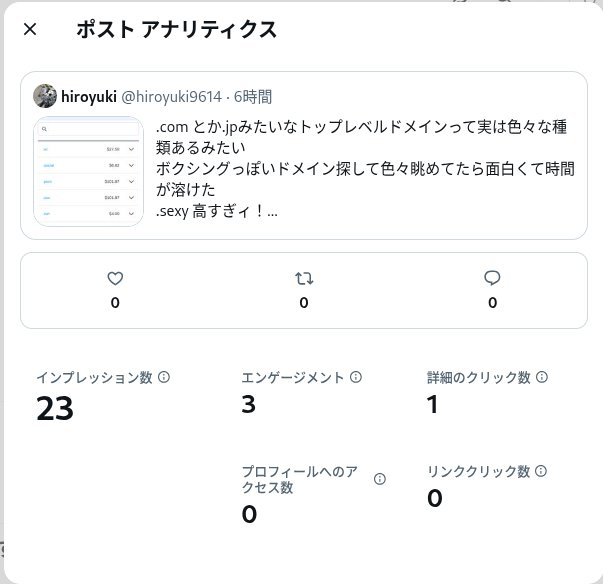
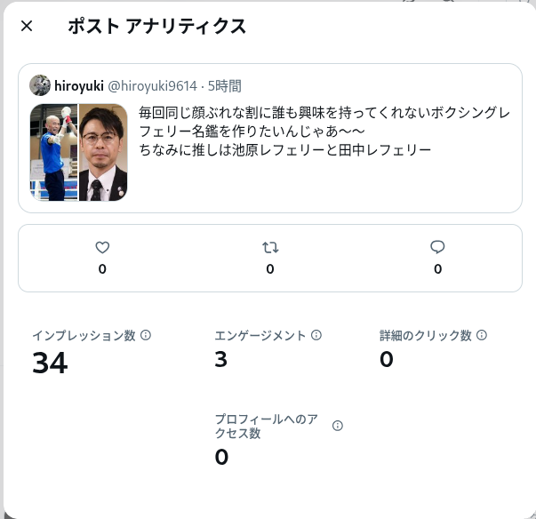
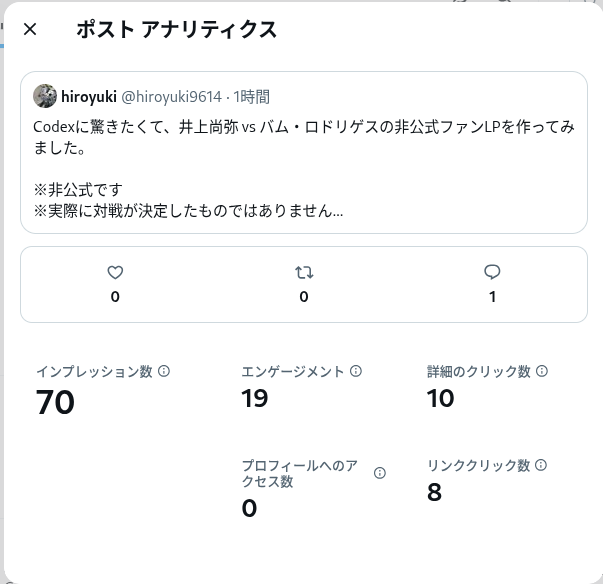

## 安心しろ お前のポストなんか誰も見ない

最近、発信を強化しています。

その中で、Xへの投稿からこのサイトに繋げるという事を目指していて、こんなポスト伸びるだろうな(ﾆﾁｬｱ

と思いながら、以下のポストをしました。

まず、このポストがみなさんにとって面白いかどうかは置いておきましょう。

<blockquote class="twitter-tweet"><p lang="ja" dir="ltr">.com とか.jpみたいなトップレベルドメインって実は色々な種類あるみたい<br>ボクシングっぽいドメイン探して色々眺めてたら面白くて時間が溶けた<br>.sexy 高すぎィ！<br>▼ユニークなTLDが取得できるサイト▼<a href="https://t.co/veiPXTF3C6">https://t.co/veiPXTF3C6</a> <a href="https://t.co/jpvbEEDRr7">pic.twitter.com/jpvbEEDRr7</a></p>&mdash; hiroyuki (@hiroyuki9614) <a href="https://x.com/hiroyuki9614/status/2060509736378986498?ref_src=twsrc%5Etfw">May 29, 2026</a></blockquote> <script async src="https://platform.x.com/widgets.js" charset="utf-8"></script>

<blockquote class="twitter-tweet"><p lang="ja" dir="ltr">毎回同じ顔ぶれな割に誰も興味を持ってくれないボクシングレフェリー名鑑を作りたいんじゃあ〜〜<br>ちなみに推しは池原レフェリーと田中レフェリー <a href="https://t.co/cuv4oWT0xr">pic.twitter.com/cuv4oWT0xr</a></p>&mdash; hiroyuki (@hiroyuki9614) <a href="https://x.com/hiroyuki9614/status/2060531440954249429?ref_src=twsrc%5Etfw">May 30, 2026</a></blockquote> <script async src="https://platform.x.com/widgets.js" charset="utf-8"></script>

<blockquote class="twitter-tweet"><p lang="ja" dir="ltr">Codexに驚きたくて、井上尚弥 vs バム・ロドリゲスの非公式ファンLPを作ってみました。<br><br>※非公式です<br>※実際に対戦が決定したものではありません<br><br>先に結論：惨敗でした。<a href="https://t.co/9lrChtzcO2">https://t.co/9lrChtzcO2</a><br><br>▼惨敗したプロンプトはこちら<a href="https://t.co/vuZRaACWFG">https://t.co/vuZRaACWFG</a></p>&mdash; hiroyuki (@hiroyuki9614) <a href="https://x.com/hiroyuki9614/status/2060585297667375289?ref_src=twsrc%5Etfw">May 30, 2026</a></blockquote> <script async src="https://platform.x.com/widgets.js" charset="utf-8"></script>

上から順に





伸びない。

特に井上尚弥 VS バムの嘘LPはボクシング層にもWEB制作者にも見られるかなと思っていた

ちょっとLP見たら分かるんですが、かなり炎上怖がってます。

誰も見ないのになぜ怖がるの？ ねえねえひろゆきくん。

### Grokに聞いてみました

餅は餅屋なんです。 Grokに聞くしか無い。

ということで聞いてみました。

### 質問

```plaintext
自分の発信なぜ伸びない？
```

なんか哀愁が漂う質問ですね・・・

自分だったらこんな事聞かれたら適当に返しますね。

宇宙の運命にまだ選ばれていないからとか言うかも。 <- これchatgptに校正出ししたら滑ってるって言われたのでそのまま出した。

余談ですが、自分が考えた元タイトルは「自分の投稿はなぜ伸びない？ Grokに聞いたら当たり前過ぎた件」

このタイトルもchatgptのアイデア。

AI臭い文章が嫌いなのでChatgptの文章はよっぽどじゃないと採用しないけどアイデアが辛辣すぎて面白かったので初めて採用した。

### 回答

<details>

<summary>Grokの回答 長いので見たい人は見てください</summary>

```
# 自分の発信が伸びない主な理由

（あなたの投稿を見て分析）

あなたの `@hiroyuki9614` さんの最近の投稿を見ると、

* インプレッションが 10〜100 程度
* エンゲージメントほぼゼロ

という、典型的な「ニッチ個人開発アカウント」の伸び悩みパターンに見えます。

原因を具体的にまとめます。

---

# 1. ターゲット / テーマが分散しすぎている

## 投稿内容

* React学習
* Codexプロンプト
* 井上尚弥ファンLP
* ボクシングレフェリー
* TLDドメイン
* 電気業界話
* アル中論争

など。

アルゴリズムは **SimClusters（興味クラスタ）** でユーザーを分類して届けます。

テーマがバラバラだと、

> 「この人は何のアカウント？」

となり、フォロワー外へのおすすめが極端に減ります。

結果として、

* 初動（投稿後30分）の反応が取れない
* アルゴリズムが「低価値」と判断
* リーチを絞られる

という流れになりやすいです。

## 対策

1つの軸に絞る。

例えば：

* 「30over Web制作者の個人開発 × ボクシング」

など。

「井上尚弥ファンLPを作ってみた」

のような具体的成果物はかなり良いので、
それをシリーズ化すると方向性が見えやすくなります。

---

# 2. 初動エンゲージメントが弱すぎる

X のアルゴリズムは、
投稿直後の反応速度をかなり重視しています。

特に返信は重要で、
「いいね」よりも高く評価される傾向があります。

あなたの投稿は、

* 反応が少ない
* 会話が発生しない

ため、すぐ埋もれやすい状態です。

## 対策

* 質問形で終わる

  * 「このLPどう思います？」
  * 「皆さんの推しレフェリーは？」
* 画像 / 動画を必ず入れる
* 投稿後、自分から似たアカウントへリプライする

---

# 3. 外部リンク投稿が不利

最近の傾向として、

* GitHub Pages
* 外部サイトURL

などを含む投稿は、
リーチが落ちるケースがかなり多いです。

特に非Premiumアカウントでは影響が大きいと言われています。

また、

> 「一般層に届けたい」

という意識も、
アルゴリズム上は逆風になりやすいです。

X はまず、

* 既存フォロワー
* 同じ興味クラスタ

への反応を優先するためです。

## 対策

* リンクは本文ではなく「最初のリプライ」に貼る
* 本文は

  * フック
  * 価値
  * 質問
    だけに絞る

---

# 4. その他の共通原因

（あなたにも当てはまる部分）

## 投稿タイミング

日本時間の夕方〜夜は比較的良い。

ただ、本来はフォロワーのアクティブ時間に合わせるのが理想。

---

## プロフィール

* Web制作
* React学習
* ボクシング

は魅力的ですが、

> 「この人は何を提供する人か」

が一目で分かりにくい。

---

## 一貫性

毎日投稿しているのはかなり良い。

ただ、

* テーマのブレ
* 投稿品質の波

がマイナスになっている可能性があります。

---

## 交流不足

* ボクシング界隈
* Web開発界隈

に自分から絡まないと、
相互作用が生まれにくいです。

---

# 即実践できる改善ステップ

（1週間だけ試す）

1. テーマを1つに絞る

   * 個人開発記録
   * ボクシングファンサイト制作
     など

2. 投稿テンプレートを固定

   * 【成果】
   * 画像
   * 学び
   * 質問

3. 毎日1〜3投稿

   * 画像必須
   * リンクはリプライへ

4. 1日20分だけ交流

   * ボクシングファン
   * React学習者
     などへリプライ

5. プロフィールを整理
   例：

   > 大阪→上京のWeb制作マン
   > React個人開発
   > ボクシング好き

---

# 最後に

伸びないのは、
内容が悪いからとは限りません。

むしろ、

* テーマ設計
* 初動
* アルゴリズムとの噛み合い

の問題がかなり大きいです。

多くの人が同じところで止まっています。

まずは、

## 「井上尚弥ファンLP」

のような、
熱量が伝わるシリーズを継続してみるのがおすすめです。

ボクシング界隈は熱量が高いため、
クラスタ内で反応が起きやすいテーマです。
```

</details>

え・・・ 説教？

休日の昼間にAIにガチ目のダメ出しされるおっさんとか面白すぎるだろ。

### 改善しないといけない点

まず、ネット陰キャはダメですね。

今の発信も今までの自分を考えたら急に大人しい子が金髪にした感じなんですよ。

ネット髪型をいくら金髪にしても陰キャは陰キャ。

あと、話が散りすぎ。 これ本当にダメですね。

普通に技術の話ししたらボクシングの話ししだして、次にアル中の話題しだす人怖い。

技術者でボクシングもなかなか正反対なのにそこにアル中は絡んだらダメ。

技術者でアル中いますか？ ボクサーでアル中いますか？ いないですよね。

わかりましたか？ ひろゆきくん。

### これから

ということで、だいぶ自分も自分自身をコンテンツ化できるようになってきました。

発信って面白いですね。

実は今、ボクシングネタのストックが50以上あります。

対して技術ネタは2つくらい・・・？

まあ、技術で好きなものを発信するってことでいいんじゃないですか？（適当）
