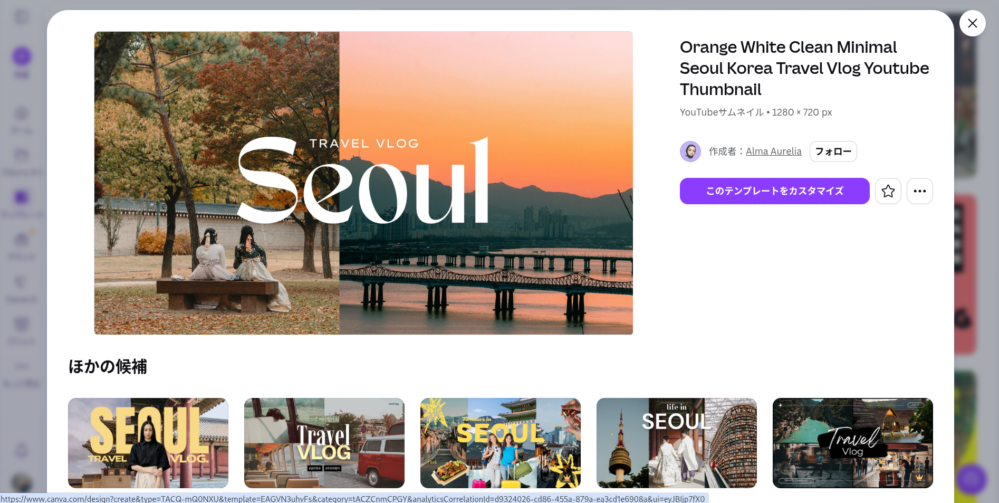
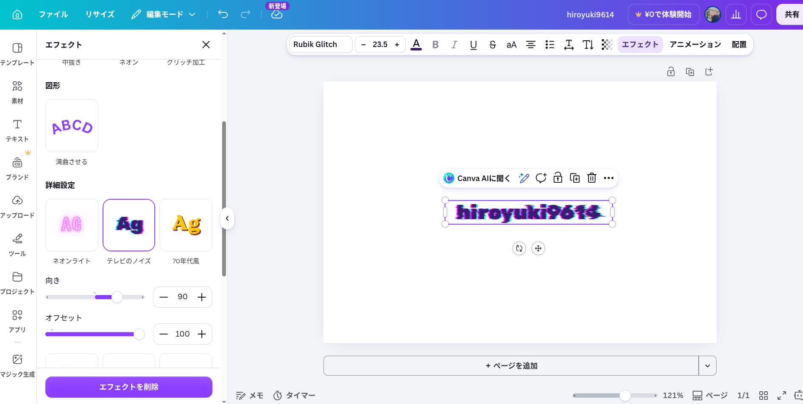
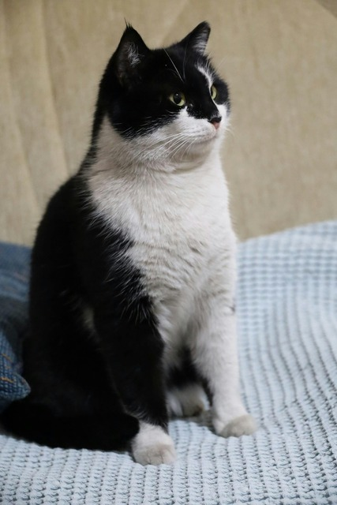
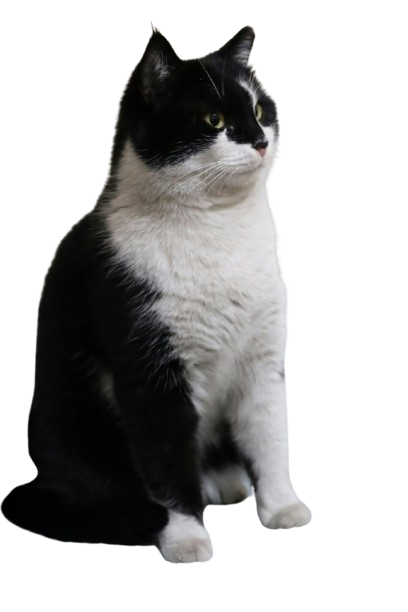
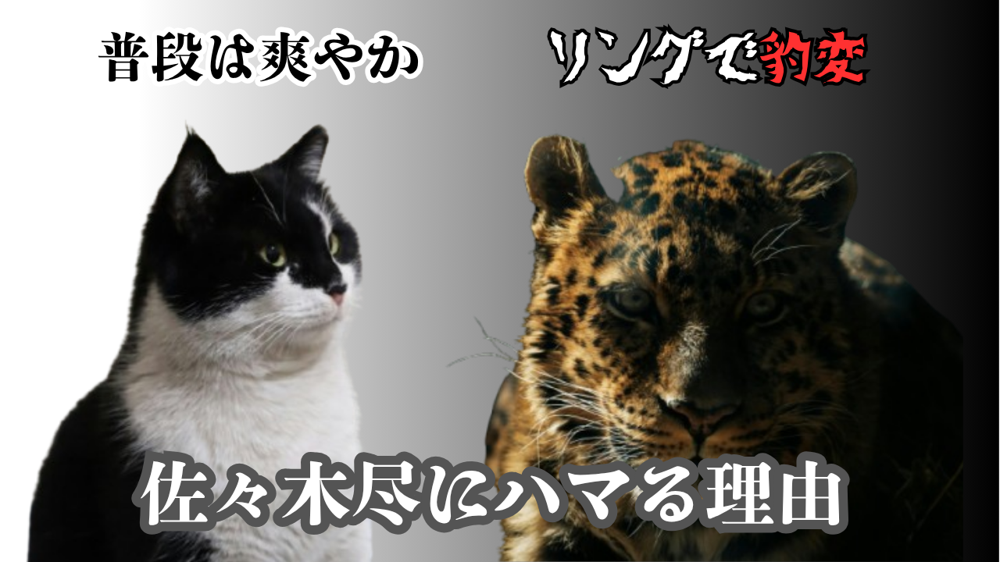
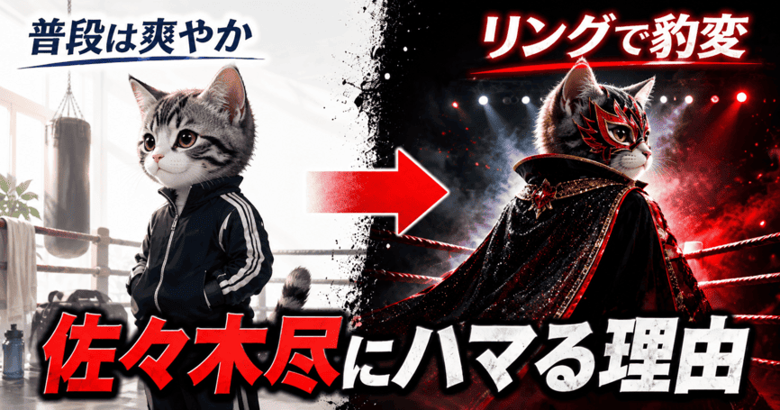

## OGP作りに負けてみた

最近Xで発信を継続していますが、目を止めるにはどうやら画像と動画が有利であることがわかってきました。

加えて、強烈なフックが必要とのこと。

自分は割と控えめな性格なのでものすごく苦手な分野です。

センスがないものを作って恥ずかしいんじゃないかなとうじうじ悩んだりします。

でも見てもらえない事には始まらないので、見てもらうための戦略を考えることにしました。

### 結論: サムネイルはクリックされるための科学が詰まっている

普段、何気なく見ているYouTubeのサムネイル、Xの画像。

全てクリックしたくなる理由があのちいさな画像の中に詰まってるんですね。

今まで何も考えていなかった自分が恥ずかしくなりました。

絶望しながらOGPを作る過程を公開します。

### OGP作りの方針

OGP作りに大事なのは以下とのこと。

- キャッチコピーがあること
- 説明しすぎないこと
- 目を引くこと
- 一瞬で情報処理できること

文字を詰め込みすぎず、情報を圧縮していきます。

個人差はあると思いますが、自分でYouTubeのサムネイルを見る感覚を試してみると眺めている時間はおよそ2〜3秒程度でした。

個人差はあるにせよ、サムネイルやOGP画像は一瞬で内容が伝わって感情を動かす画像を作る必要があります。

なので説明過多には特に気をつけます。

### ボツ 初めてのOGP作りに挑戦

佐々木尽選手を紹介する記事のOGPを作っていました。

[記事はこちら](https://hiroyuki9614.github.io/my_profile/posts/post_2605029/)

宣伝はそこそこに過程を公開します。

#### 参考を見つける

まずは参考を見つけることから始めました。 できればかっこよく紹介したいから、

Boxing And Boxingさん！

<iframe width="560" height="315" src="https://www.youtube.com/embed/yp_gN8qjt2o?si=GKlOBCNS0f4Eq-kQ" title="YouTube video player" frameborder="0" allow="accelerometer; autoplay; clipboard-write; encrypted-media; gyroscope; picture-in-picture; web-share" referrerpolicy="strict-origin-when-cross-origin" allowfullscreen></iframe>

 

こんな感じで目を引くようにしたい！

#### 色々なツールを駆使する

今までCanva使ってなかったですが本当にすごいツールですね。

こうやってテンプレートがあったり、

文字もいっぱいある！

無料版でも機能は十分です。

[Remove.bg](https://www.remove.bg/ja) 
しかもこのサイトで画像の切り抜きまでできる！

**Before**

**After**

#### 参考を真似してみる

 

Boxing And Boxingさん名前を出してすみませんでした。

なんかすごいことになりました。

佐々木尽選手本当にごめんなさい。 佐々木尽選手は本当にかっこいい選手なんです。

### 反省点

まずインプット不足が露呈する結果となりました。

豹変を表すために猫と豹という対比にしましたが、少し雑ですね・・・

著作物を使えないという都合があるので画像を中心に組み立てるべきでした。

普段から参考になりそうなものはこうやって試行錯誤して何が使えそうな視点を養うべなのでしょう。

### おまけ chatGPTで画像生成した

ちなみにChatGPTに頼んでみました。

こういうAI臭い画像のクリック率は下がらないか？と聞いたところ、

お前の画像よりはマシと怒っていました。

しかしこういうサムネ見たことあるなあ。

個人的にこういうサムネイルは冷めてしまうので人の心を動かすのってきれいさとかじゃないのでしょうね

人の感情を動かすのって難しい・・・
