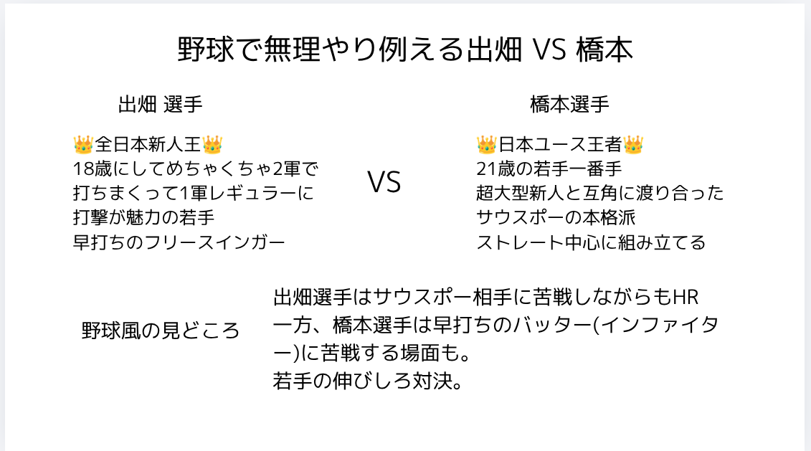
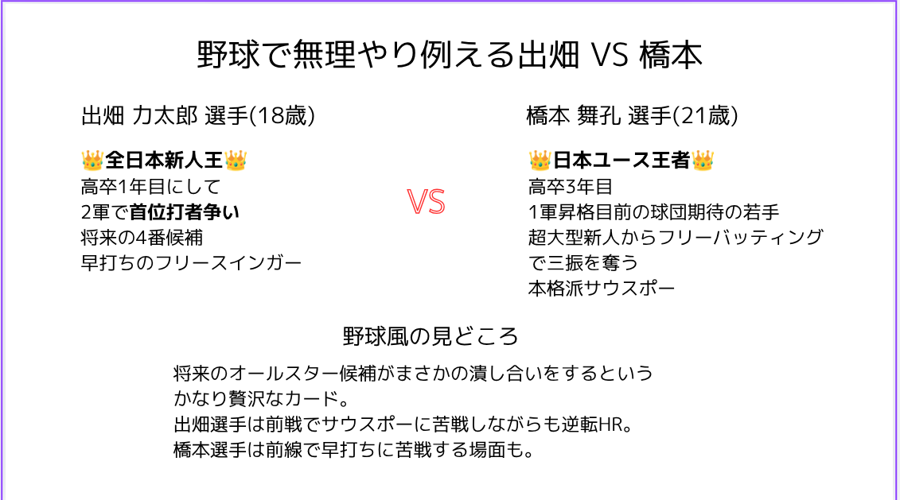
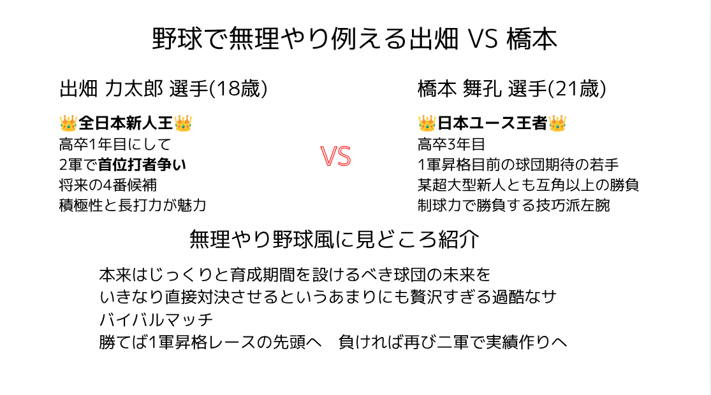
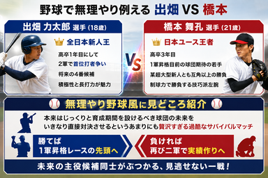

## ボクシングを野球で例える図解をAIと作ってみた

自分のXアカウントはボクシング発信を通じて、ストーリーの深堀りをすることと、そのストーリーをわかりやすく伝えることを鍛えるということを目的としています。

詳しい説明は省きますが、橋本選手と出畑選手の対戦という、とてもストーリーがあるボクシングの試合がありました。

それに対して最初、自分はこういう投稿をしました。

<blockquote class="twitter-tweet">
日本人ライト級の若手戦線がまじで漫画みたいな事なってる 高校生デビュー全日本新人王の出畑選手と、大橋ジムのホープ藤木選手とバチバチに公開スパーでやりあった橋本選手が対戦 これチケット買う価値しかないだろ というか買うわ
&mdash; hiroyuki@ボクシング初級観戦者 (@hiroyuki9614) <a href="https://x.com/hiroyuki9614/status/2063026096199946288?ref_src=twsrc%5Etfw">June 5, 2026</a></blockquote>  

しっかりと自分の投稿を分析したところ、以下の課題が見つかります。

※以下の分析はあくまでもボクシングを知らない人に対してです

>日本人ライト級 -> ？？？
>
>漫画みたいな事なってる -> どういう風に？
>
>高校生デビュー全日本新人王 -> で、それの何が凄いの？
>
>大橋ジムのホープ藤木選手 -> 誰？
>
>とバチバチに公開スパーでやりあった -> ん？
>
>それの何が凄いの？ 橋本選手が対戦 -> 誰？

つまり、自分が凄いと思っている部分がまったく他人に伝わっていない可能性が高いという事です。

### 他のもので例えてみる

なので、一度野球で例えながらChatGPTと壁打ちを繰り返します。

最初の案

まず、説明が過剰で内容が入ってきません。 あまりに情報量が多いです。

そして野球用語も抽象的で理解しづらいです。

野球用語を具体的にしました。

しかし、今度は野球用語が複雑になりました。

今でも情報量が多いので削っていきます。

>早打ちのフリースインガー
>
>本格派サウスポー

これらは分かりやすいので書き換え。

>超大型新人からフリーバッティングで三振を奪う

これは長い。

また、見どころも本来自分が見てほしいところを強調します。

最終的にこういう形にしました。

正直、結構時間を書けてしまっていてタイパが悪いので切り上げ。

### 本題 AIにデザインを依頼する

ここからが本題です。

ある程度自分が見せたいものが固まりました。

しかし、それをどうやって見せるか？という問題が残っています。

その解決方法の一つがデザインです。

何を隠そう、自分はデザイン弱者。 さすがにここに時間をかけると趣味の領域を遥かに超えてしまいます。

なのでAIに依頼をしてみました。 できあがったものがこちら。

正直、見栄えがいいですが説明不能のAI生成感が漂います。

ただ、自分が作った図よりは遥かに見栄えがいいので、これでいくことにしました。

### まとめ

以上、これが自分が考えるAI生成でデザイン弱者が弱点を補う方法です。

まずは構図を決めてしまうこと、文章を考えることでAIによる予期せぬデザインをコントロールしました。

ただ課題として、AI臭がただようデザインはどうにかしないといけません。

そもそも、何がAI画像がAI画像たらしめているのだろうか・・・

引き続き解決方法を探っていきます。
