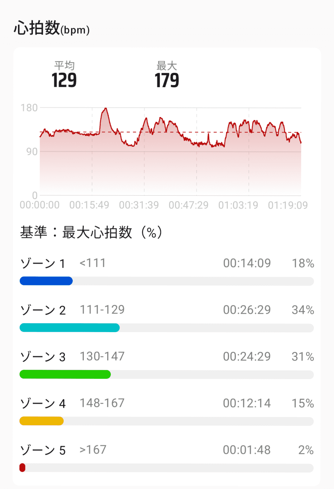

## 何のための根性？ 根性論を少しだけ分解したい

最近、ランニングをすることが多くなってきました。

トレーニング中にふと思ったのですが、根性が数値化されていないのはすごく勿体ない気がします。

### 根性論の数値化とは

ジムでランニングをしている時に、若い方が明確に限界付近でのトレーニングをしていました。

それを見た時に、「若いなあ(いいなあ)」と思ったと同時に「何を目的としたトレーニングなんだろう」と思わず考えてしまいました。

限界付近でのトレーニングで自分の負荷をコントロールできていないというのは、まず速くなるためのトレーニングとしては適していないだろうと思われます。

そして、疲労も馬鹿にならないでしょう。

でも、心拍数90%近いレンジでのトレーニングには精神的な負荷に耐えるという副次的効果があり、完全には無駄とは言えません。

とはいえ、身体のコントロールを失いながら精神だけを保っていても競技では意味がありません。

と考えた時に、根性論も数値化して管理する方法があるんじゃないかと思い至りました。

### なぜ根性論も数値化が可能と考えたか

自分が自分をコントロールしながらの本気走りも、コントロールを失って前に進むだけが目的となった走りでも同じ心拍数は180bpm 限界付近です。

つまり、限界心拍数を超えていなくても自分の身体をコントロールできる余地はあるわけです。

この時に、いかに長く最高心拍数付近で自分をコントロールできるかが数値化できる根性のひとつなのではないかなと自分は考えました。

例えばボクシングだと、息が切れている選手でもグローブを上げてクリンチをしにいかないと殴られてしまう。

陸上競技だと単純に心理的なブレーキが身体的なブレーキに直結するのではないかと思います。

### 仮説 こうやって根性を伸ばす

最大心拍数付近での運動維持時間が増えていくことを根性と定義します。

最大心拍数付近でも粘れる人です。

ということで、まずは自分の身体で試してみます。

割と今、トレーニングで心拍数180bpm付近での運動維持時間が増えてきているので、この時間が増えていくか。(根性1)

一日に何度もそのゾーンに入れるか(根性2)

とみなしていきます。

仮説を立てたはいいものの、やはり感覚のものを数値化するのは難しいですね。

全力で走れる距離を伸ばしていく方法が再現性が高いのかもしれませんが、技術に依存する部分も大いにあると思うので。

なので数値化はもちろんですが、後知恵バイアスのリスクしかないですが感覚を数値で説明できるところまで行くのが落とし所としていきます。

### なぜこう思ったか

最近、心拍数を計測しながらのトレーニングにハマっています。

最初はそのZONE2トレーニング目的で心拍数を測っていたのですが、気がついたら自分の運動全体でも心拍数を測るようになりました。

画像 ある一日の運動

こうやって心拍数を測りながらトレーニングをしていると、やはり疲労管理が楽になります。

特に、限界が近い感覚と心拍数が符号するので、感覚に頼る割合が減らせるんじゃないかなと感じています。

### 補足 ZONE2トレーニングについて

ZONE2トレーニングについては以下の動画がわかりやすく解説されていました。

  <iframe width="560" height="315" src="https://www.youtube.com/embed/AkXPvY_3qJc?si=aJxfozNN1L347H2L" title="YouTube video player" frameborder="0" allow="accelerometer; autoplay; clipboard-write; encrypted-media; gyroscope; picture-in-picture; web-share" referrerpolicy="strict-origin-when-cross-origin" allowfullscreen></iframe>

乱暴な単純化をすれば、疲労が蓄積しづらいギリギリの強度で運動をすることで、心肺機能の向上をはかるためのトレーニングです。

自分としてはメインはボクシング練習なので、ボクシングに疲労が影響しないことと、疲労管理のためにZONE2トレーニングを取り入れています。

### 心拍数トレーニングとその疲れ方

以下、自分の体感ですが心拍数ごとの疲れ方です。

運動習慣によって体感は大きく異なるので、あくまで参考程度です。

これが心拍数が上がりやすいのかそうではないのかは不明です。

- 30代中盤
- 男性
- 運動は週5〜6回
- ボクシング系のエクササイズが多め
- 最大心拍数は184くらい

| 心拍数 | 体感 |
|---:|---|
| 110 | ゆっくり〜早歩き。ほぼしんどさなし |
| 120 | 早歩きくらい。まだ楽 |
| 130 | 走るか走らないかくらい。汗はかく |
| 140〜160 | 頑張って走るくらい。長くは続かない |
| 170〜175 | 本気走りに近い。嫌だなと思うライン |
| 180〜 | 限界付近。身体の反応が鈍くなる感覚 |

### まとめ

ということで、公開するしないは別として比較的再現性が高いと思われる限界走を月1程度で定期的に行って、根性が伸びたかどうか計測してみます。

さすがに1年続いたらどこかで公開するはずなので、公開されなかったらそういうことです。
