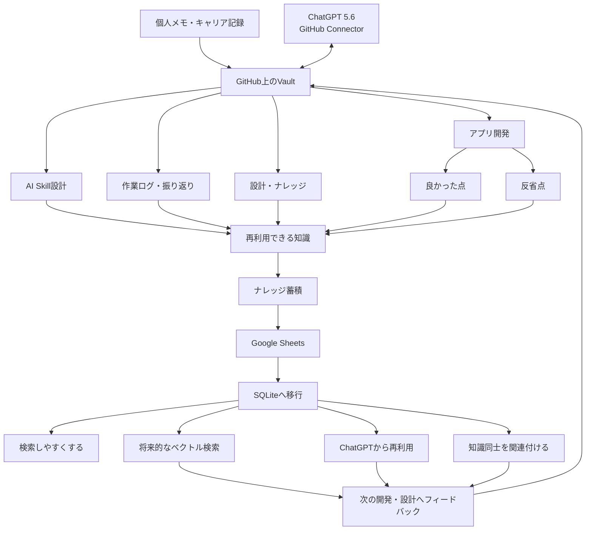

## 初めてみると終わらないVault整備

まず、Vaultという概念についてですが、英語で「金庫」を意味する言葉です。

Obsidian という文章管理ツールを利用して、個人の知識基盤を作成するためのフォルダ構造を「Vault」と呼ぶようです。

このVaultなんですが、色々と文章を管理する方法があります。

詳しくは書きません(というか書けない)ですが、今回githubで作成しました。

### chat-gpt 5.6 github connectorの威力

自分は個人的に chat-gpt plusプランを契約しているのですが、これがものすごくgithubに設置したvaultと相性が良かったです。

読み込みだけじゃなく、書き込みもできてしまいます。 なんならクラウド上でツールまで作れてしまいます。

最初は個人メモやキャリアについてだけ残していくつもりが人間の欲は深く、どんどんvaultにナレッジが蓄積しています。

以下、AIに出力させた構成図

### 個人的に面白いと思った点

アプリやスキルを作成しているのですが、これがかなりナレッジとして蓄積されていきます。

例えば反省点や良かった点や再利用できそうな点をどんどんと記録しているのですがこれが効いてきます。

もっと紹介したい概念が大量にあるのですが、今やっていることについて紹介します。

#### ナレッジをsqliteに保存する

google driveの sheetsもChat-gptは操作できるので、ナレッジは google driveの sheetsに保存していました。

しかし、以下の理由でsqlite化をすることにしました。

- 将来的なベクトル検索
- ナレッジ同士の関連付け
- 再利用性
- ChatGPTからの扱いやすさ
- データ量が増えたときの管理

もう正直なところ個人でやるレベルを超えてしまったのですが、楽しすぎてかなりの時間を投下しています。

## まとめ

ということで、vaultについて紹介しましたが正直人に見せるナレッジとしてはかなり弱いので、

今後は個別に共有できたらと思います。

vault運用を始めて思いましたが、今までは実力を出し切れていませんでした。

結構、vaultと chat-gptを使い倒してわかってきたことも多いので、何点か記事をアップしていきます。
